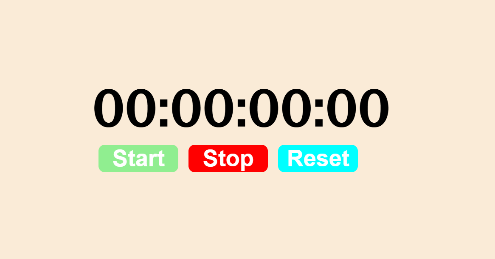

# ⏱️ Stopwatch App

A clean and simple stopwatch built with pure HTML, CSS, and JavaScript.

## 🚀 Features

- Start, Stop, and Reset functionality
- Displays hours, minutes, seconds, and milliseconds
- Minimal and responsive design

## 🛠️ Built With

- HTML
- CSS
- JavaScript (Vanilla)

## 📸 Preview



## 🚀 How to Run

1. Clone the repo:
```bash
   git clone https://github.com/chhaysokrithea-cloud/stopwatch-app.git
```
2. Open `index.html` in your browser

## 📁 Project Structure
stopwatch-app/
- index.html(idex.html)
- style.css(style.css)
- script.js(script.js)
